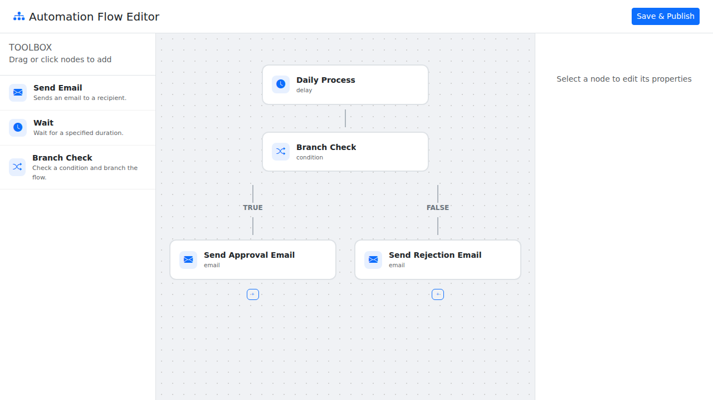
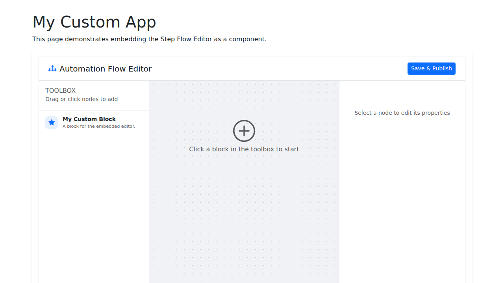

# Step Flow Editor

A powerful, extensible, step-by-step workflow editor for Golang projects, similar to Power Automate. This library provides an embeddable UI that allows users to build and configure complex flows with support for branching and conditional logic.


## Features

- **Branching Support**: Create complex workflows with conditional paths (e.g., True/False branches).
- **Embeddable**: Easily mount the editor on any HTTP endpoint or embed it as a standalone UI component in your existing page.
- **Extensible**: Define your own step types and branch names by implementing a simple Go interface.
- **Reactive UI**: Built with Vue.js 3 and Bootstrap for a modern, responsive "canvas-style" experience.
- **JSON Serialization**: Load and save flows as deeply nested JSON structures.
- **Interactive**: Drag-and-drop feel with recursive rendering and specialized node settings.

## Installation

```bash
go get github.com/dracory/stepeditor
```

## Quick Start

```go
package main

import (
	"net/http"
	"github.com/dracory/stepeditor"
)

// Define a custom step with branching
type ConditionStep struct{}

func (b ConditionStep) StepDefinition() stepeditor.StepDefinition {
	return stepeditor.StepDefinition{
		Type:        "condition",
		Title:       "Branch Check",
		Description: "Check a condition and branch the flow.",
		Icon:        "bi-shuffle",
		DefaultData: map[string]string{
			"variable": "status",
			"operator": "==",
			"value":    "approved",
		},
		BranchNames: []string{"True", "False"},
	}
}

func main() {
	editor := stepeditor.New(stepeditor.Config{
		Endpoint: "/editor",
		StepDefinitions: []stepeditor.CustomStep{
			ConditionStep{},
			// ... other steps
		},
	})

	// Mount the editor
	http.Handle("/editor/", editor)

	http.ListenAndServe(":8080", nil)
}
```

## Embedding as a Component

You can embed the editor as a compartmentalized UI step in any page:

```go
editor := stepeditor.New(stepeditor.Config{
    ID:       "my-editor",
    Endpoint: "/api/editor",
})

// In your template
layoutHTML = layout(editor.ToHTML())
```

## Examples

The following examples demonstrate different ways to use the editor:

### Standalone Editor
Demonstrates how to mount the editor on a dedicated HTTP endpoint.

Source: [examples/standalone/main.go](examples/standalone/main.go)

### Embedded Editor
Demonstrates how to embed the editor as a component within a custom HTML layout.

Source: [examples/embedded/main.go](examples/embedded/main.go)

## API

### `stepeditor.New(config Config) *Editor`

Creates a new editor instance.

### `Editor.ServeHTTP(w, r)`

Handles HTTP requests. Mount this on your router.

### `Editor.ToHTML() string`

Returns the self-contained HTML for the editor component, including scoped CSS and isolated JavaScript.

### `Editor.GetFlow() []Step`

Returns the current flow as a slice of `Step` structs, including nested branches.

### `Editor.SetFlow(flow []Step)`

Sets the current flow.

## Custom Steps

To create a custom step, implement the `CustomStep` interface:

```go
type CustomStep interface {
	StepDefinition() StepDefinition
}
```

The `StepDefinition` includes:
- `Type`: Unique identifier for the step type.
- `Title`: Display name.
- `Description`: Short description.
- `Icon`: Bootstrap Icon class (e.g., `bi-shuffle`).
- `DefaultData`: Map of default attributes.
- `BranchNames`: Optional slice of strings defining branch names for this step type.
