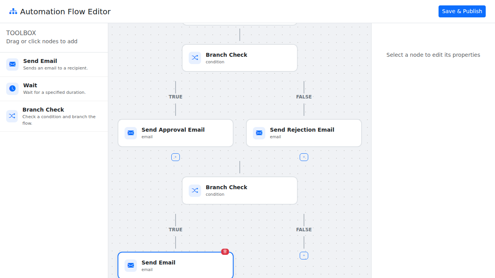

# Step Flow Editor

A powerful, extensible, step-by-step workflow editor for Golang projects, similar to Power Automate. This library provides an embeddable UI that allows users to build and configure complex flows with support for branching and conditional logic.



## Features

- **Branching Support**: Create complex workflows with conditional paths (e.g., True/False branches).
- **Embeddable**: Easily mount the editor on any HTTP endpoint in your Go application.
- **Extensible**: Define your own block types and branch names by implementing a simple Go interface.
- **Reactive UI**: Built with Vue.js 3 and Bootstrap for a modern, responsive "canvas-style" experience.
- **JSON Serialization**: Load and save flows as deeply nested JSON structures.
- **Interactive**: Drag-and-drop feel with recursive rendering and specialized node settings.

## Installation

```bash
go get github.com/username/stepfloweditor
```

## Quick Start

```go
package main

import (
	"net/http"
	"github.com/username/stepfloweditor"
)

// Define a custom block with branching
type ConditionBlock struct{}

func (b ConditionBlock) Definition() stepfloweditor.BlockDefinition {
	return stepfloweditor.BlockDefinition{
		Type:        "condition",
		Title:       "Branch Check",
		Description: "Check a condition and branch the flow.",
		Icon:        "bi-shuffle",
		DefaultData: map[string]string{
			"variable": "status",
			"operator": "==",
			"value":    "approved",
		},
		BranchNames: []string{"True", "False"},
	}
}

func main() {
	editor := stepfloweditor.New(stepfloweditor.NewConfig{
		Endpoint: "/editor",
		Blocks: []stepfloweditor.CustomBlock{
			ConditionBlock{},
			// ... other blocks
		},
	})

	// Mount the editor
	http.Handle("/editor/", editor)

	http.ListenAndServe(":8080", nil)
}
```

## API

### `stepfloweditor.New(config NewConfig) *Editor`

Creates a new editor instance.

### `Editor.ServeHTTP(w, r)`

Handles HTTP requests. Mount this on your router.

### `Editor.GetFlow() []Block`

Returns the current flow as a slice of `Block` structs, including nested branches.

### `Editor.SetFlow(flow []Block)`

Sets the current flow.

## Custom Blocks

To create a custom block, implement the `CustomBlock` interface:

```go
type CustomBlock interface {
	Definition() BlockDefinition
}
```

The `BlockDefinition` includes:
- `Type`: Unique identifier for the block type.
- `Title`: Display name.
- `Description`: Short description.
- `Icon`: Bootstrap Icon class (e.g., `bi-shuffle`).
- `DefaultData`: Map of default attributes.
- `BranchNames`: Optional slice of strings defining branch names for this block type.
